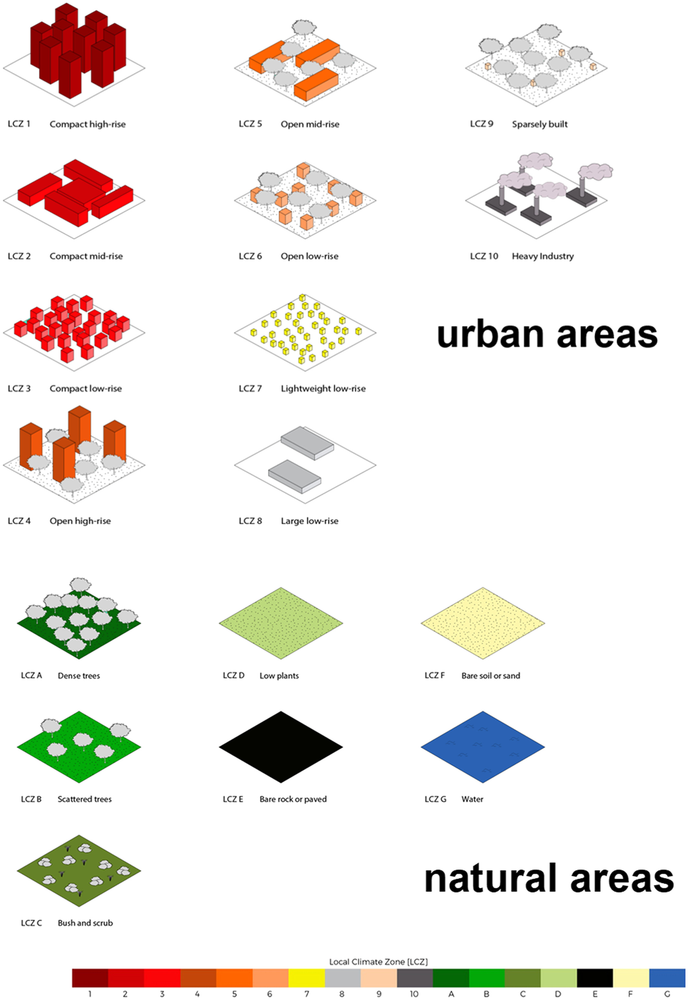
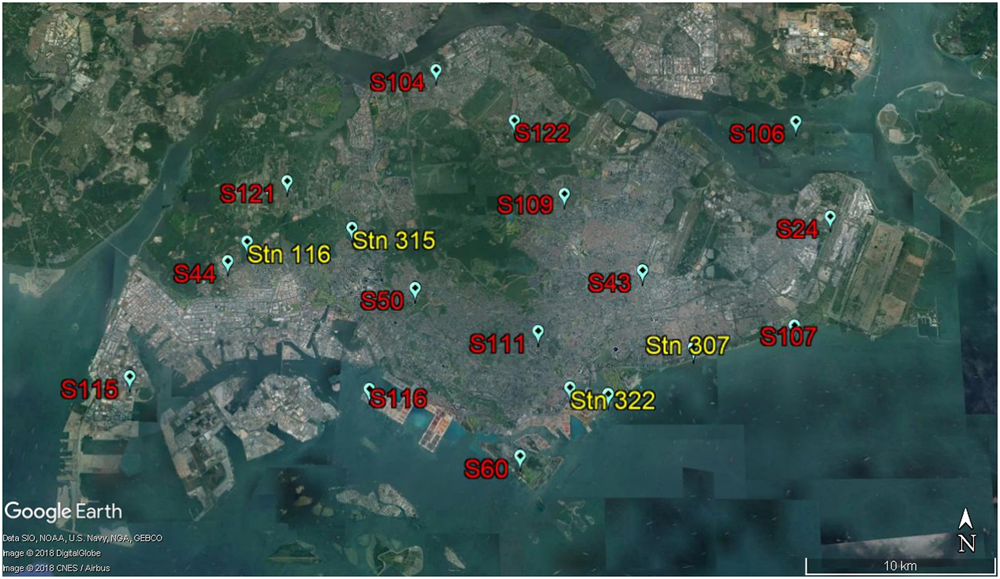

# Estimation of Air Temperature Using Satellite Imagery

----

## Background & External Research

Research has shown that higher temperatures above the historical mean can have detrimental effects on human health and productivity (insert ref). This issue is exacerbated by the Urban Heat Island (UHI) effect for a highly urbanised environment like Singapore. To further complicate the issue, air temperature distribution is uneven across the island and there are 'hotspots'. Thus, knowing the air temperature profile of Singapore is important in identifying these 'hotspots' to tackle Urban Heat Island (UHI) effects, particularly as global mean temperatures are expected to continue to rise due to climate change.

Traditional air temperature readings are taken using ground-based weather stations at strategic locations. These are most accurate but insufficient due to:
1. **Low density** - most locations which do not have weather stations deployed need to interpolate air temperature based on measurements from nearest weather stations
2. **Uneven distribution** - locations of weather stations is limited by ground conditions such as restricted access or local disturbances

Alternative methods to estimate air temperature have been a topic of active research. In particular, satellite imagery based methods enables wide coverage (i.e. can capture the entire island at once) and good availability (i.e. publicly available satellite images from SENTINEL, MODIS, LANDSAT etc.). However, these methods have reached a limited level of success (RMSE of 1.88°C~2.33°C) due to micro-scale land cover and associated physical properties ([C. Wang et al, 2022](https://www.mdpi.com/2072-4292/14/8/1916)., [R Santos, 2020.](https://www.sciencedirect.com/science/article/pii/S030324341831033X)).

In 2012, the concept of Local Climate Zones (LCZs) was introduced to address these issues and since been adopted as the new standard for characterising urban landscapes. This LCZ framework classifies urban landscapes into 10 different classes, associated with different UHI profiles. Using LCZs to estimate air temperature may improve the performance of current methods, but application has been limited because of the difficulty in identifying LCZs without the use of ground surveys.

Recent developments in image recognition (e.g., vision transformers) offer promise in identifying LCZs using satellite images alone, and make it feasible to use LCZs as a component in estimating air temperatures.

## Problem Statement

This project aims to **develop a localised proof-of-concept model to estimate surface air temperature in Singapore, locating 'hotspots' and locations that are getting hotter, using satellite imagery derived information including LCZs**.

Such estimates will value-add to the following groups of stakeholders:
1. Public officials planning infrastructural and behavioural interventions to mitigation high air temperatures in particular 'hotspots'.
2. Local businesses and organisations operating in 'hotspots' can take mitigation measures such as changing the timing or location of their operations or building infrastructure to reduce temperatures.
3. Citizens can avoid these 'hotspots' to feel more comfortable (unless they are staying in those 'hotspots').

## Methodology and Platforms

This project will take a 3-phase approach:
1. Processing and aligning satellite images of different spectra and meteorological data  of Singapore
    - We will try **Google Earth Engine** to access and process these images
    - We will use **data.gov.sg** to obtain weather station data
2. Training model LCZ identification via transfer learning
    - We will try **Google Cloud Console** to train the model
3. Building model air temperature estimation
    - We will use local machine to build this model

## Models

We will try the following models for LCZ:
* Vision Transformer (build on [RSNNet architecture](https://www.tandfonline.com/doi/full/10.1080/10095020.2022.2030654))
* CNN (build on [Sen2LCZ-Net-MF](https://ieeexplore.ieee.org/abstract/document/9103196))
* CNN (build on [ResNet-50](https://datagen.tech/guides/computer-vision/resnet-50/))
 *Metric: Overall accuracy*

We will try the following models for air temperature estimation (based on models used in papers in background paragraphs):
* Random Forest Classifier
* SVM
* Gradient Boost/Ada Boost
 *Metric: RMSE, MAE*

## Datasets

#### Model for LCZ Identification will use 
* Training data from [**So2Sat LCZ42**](https://paperswithcode.com/dataset/so2sat-lcz42) - LCZ labels of ~500k SENTINEL-1 and SENTINEL-2 image patches in 42 urban agglomerations across the globe, access via [tensorflow in python](https://github.com/zhu-xlab/So2Sat-LCZ42)
* Test data from images of Singapore from [**SENTINEL-2 data obtained through Google Earth Engine**](https://developers.google.com/earth-engine/datasets/catalog/sentinel-2) and potentially match with results from this [paper](https://agupubs.onlinelibrary.wiley.com/doi/full/10.1029/2018JD029796)

#### Model for Air Temperature Estimation will use
* **Air temperature measurements** from [**NEA's weather stations**](https://data.gov.sg/dataset/realtime-weather-readings) as groung truth
* **Land surface temperature** estimates computed from [**SENTINEL-3 data fused with SENTINEL-2 data**](https://medium.com/sentinel-hub/data-fusion-combine-satellite-datasets-to-unlock-new-possibilities-26356c481169)

## Risks and Challenges

Dataset risks are **moderate**. 
* All datasets are assessed to be accessible with either manual download or APIs. Main risk is the feasibility of fusion of SENTINEL-3 and SENTINEL-2 data, given that the latter does not have the images to compute land surface temperature which is essential to air temperature estimation. This will only be known after testing out the fusion.

Modelling risks are **moderate**. 
* Large training dataset for LCZ identification model may mean training will take a lot of time even with Google Cloud Console. This can be partly mitigated with a random selection of the 500k images to speed up training and potentially reduce performance.
* Performance of air temperature estimation may still be very bad, which cannot be mitigated.

